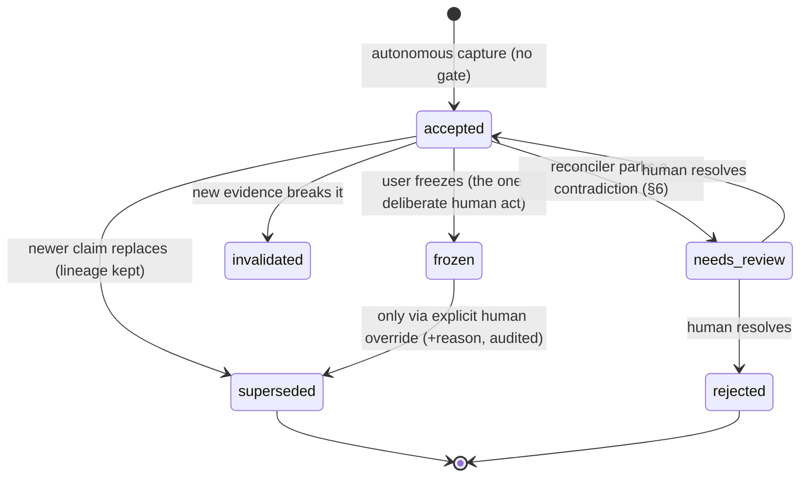
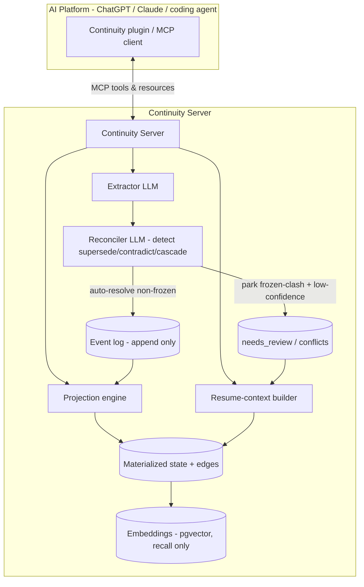
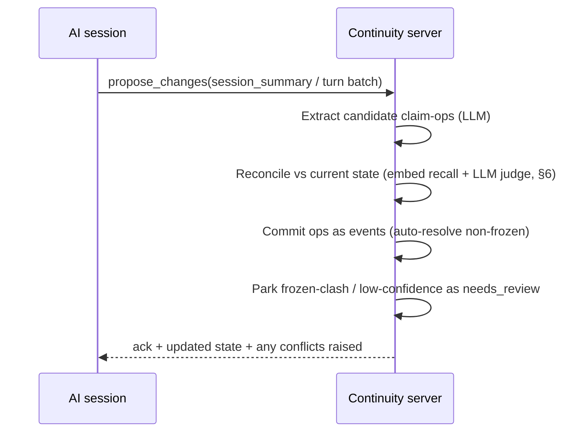

# AI Continuity Layer — Technical Design

**Status:** Draft v0.2 — core design validated by a 2-agent proof-of-concept (see §11)
**Scope:** The MVP — *continue a long-running AI project in a new session without losing its direction, decisions, or state.*

---

## 1. The core idea, stated technically

A memory product answers *"what was said before?"* — usually via retrieval over embedded chunks. That is the wrong primitive here.

The Continuity Layer answers a different question: *"given everything that happened, what is the project's state **now**?"* That is a **projection over a versioned, typed knowledge graph** — not a search over history.

Two design commitments follow from this and drive everything below:

1. **Event-sourced core.** The source of truth is an append-only log of *events* (a claim was proposed, accepted, superseded, corrected, frozen). Current state is a *materialized projection* folded from that log. This is what makes version history, rollback, audit trails, and "why did this change?" fall out for free instead of being bolted on.

2. **Typed lifecycle, not flat facts.** Every unit of knowledge is a **Claim** with a *type* and a *status that moves through a state machine* (idea → proposal → decision → superseded; hypothesis → rejected; constraint → frozen). The status is what lets us answer "which of these three conflicting statements is current, and why."

**What the moat actually is (sharpened by the POC, §11): determinism, not out-reasoning the model.** A strong model with a clean, small context can often re-derive current state on its own. The engine's value is that it delivers the *right* current state *reliably* — independent of model strength, context size, retrieval luck, or how many claims the project has accumulated. Every guarantee below (frozen enforcement, supersession, reconciliation, cascade) is a determinism guarantee.

Everything else — extraction, MCP surface, storage — is in service of these two.

---

## 2. Data model

### 2.1 The atom: `Claim`

A Claim is one durable unit of project knowledge. It is *not* a conversation turn; it is a distilled assertion the project depends on.

```jsonc
{
  "id": "clm_01J...",              // ULID, stable forever
  "project_id": "prj_01J...",
  "type": "decision",              // see §2.2
  "title": "Use Postgres + pgvector, not a dedicated vector DB",
  "body": "Single store simplifies ops at our scale; revisit past ~50M vectors.",
  "status": "frozen",              // see §2.3
  "confidence": "confirmed",       // unverified | tentative | confirmed
  "provenance": {
    "origin": "auto",              // auto | manual | imported
    "model": "claude-opus-4-8",
    "session_id": "ses_...",
    "evidence": ["evt_...", "turn:ses_..#142"]  // what backs this claim
  },
  "version": 3,
  "supersedes": ["clm_older"],
  "superseded_by": null,
  "depends_on": ["clm_arch_root"],
  "contradicts": [],               // populated by detector (§6)
  "tags": ["architecture", "storage"],
  "created_at": "...", "updated_at": "..."
}
```

Design notes:
- `provenance.evidence` + `confidence` are mandatory and are what make the resume context *trustworthy* rather than plausible. **Capture is autonomous — there is no approval gate (see §4)** — so these fields, not a human gatekeeper, are the trust mechanism: a low-confidence `origin: auto` claim still enters, but is surfaced in the resume context as tentative so the next session calibrates rather than trusting blindly.
- `version` + `supersedes`/`superseded_by` form the lineage. The full history lives in the event log; these are denormalized pointers on the projection for fast reads.

### 2.2 Claim types

| type | question it answers | terminal-good states |
|---|---|---|
| `mission` | what is this project for | active |
| `requirement` | what must it do | accepted / superseded |
| `decision` | what did we choose | accepted / frozen / superseded / invalidated |
| `constraint` | what are we bound by | active / frozen / lifted |
| `architecture` | how is it built | active / superseded |
| `milestone` | what stage are we at | open / completed |
| `hypothesis` | what are we testing | confirmed / rejected |
| `experiment` | what did we try, result | recorded |
| `risk` | what could go wrong | open / mitigated / accepted |
| `question` | what's unresolved | open / resolved |
| `next_action` | what to do next | open / done |
| `rejected_alternative` | what we chose *against* + why | rejected (permanent) |

`rejected_alternative` is a first-class type on purpose — see §5, it is the mechanism that stops a fresh session from re-proposing dead paths.

### 2.3 Status lifecycle (the differentiator)

Each type has an allowed transition set. Illegal transitions are rejected at the write layer. Two matter most:



- **Capture is autonomous** (§4): an extracted claim enters as `accepted` with no approval step. Illegal *type* transitions are still rejected at the write layer.
- **`frozen`** = "must never be changed." A later event that would alter or contradict a frozen claim is **never auto-applied** — the conflicting newcomer is parked as `needs_review` and surfaced; the frozen claim is untouched. Overriding a frozen claim requires an explicit human act carrying a reason (audited). This is the vision's "frozen baseline," enforced rather than hoped-for. *(POC-validated: an autonomous capture of "8-char codes" against a frozen 7-char format was parked, not applied.)*
- **`needs_review`** = the reconciler found a contradiction it must not resolve on its own (against a frozen claim, or low-confidence). Excluded from active state; surfaced loudly in the resume context.
- **`superseded`** / **`invalidated`** claims are never deleted. They stay queryable (`why did X change?`) but are excluded from resume context by default.

### 2.4 Events (the real source of truth)

```jsonc
{
  "id": "evt_01J...",
  "project_id": "prj_...",
  "type": "ClaimAccepted",   // ClaimProposed | ClaimAccepted | ClaimSuperseded
                             // | ClaimFrozen | ClaimRejected | ClaimInvalidated
                             // | UserCorrection | ClaimEdited | Rollback
  "claim_id": "clm_...",
  "payload": { /* type-specific: prior/next status, diff, reason */ },
  "actor": "user" | "extractor" | "system",
  "at": "..."
}
```

Current state = `fold(events)`. This gives us, with no extra machinery:
- **version rollback** — replay the log up to event N, or emit compensating events;
- **audit trail** — the log *is* the audit trail (enterprise feature, free);
- **"why"** — every status change carries its triggering event + reason.

---

## 3. System architecture



Components:
- **Extractor** — LLM that turns raw conversation into claim operations (§4). Capture is autonomous; ops commit directly to the log.
- **Reconciler** — matches each new claim against existing state (§6) and auto-resolves non-frozen supersessions/contradictions, but *parks* anything touching a frozen claim (or low-confidence) as `needs_review` instead of applying it.
- **Event log** — append-only, the source of truth.
- **Projection engine** — folds events into the materialized state + edge graph.
- **Resume-context builder** — deterministic projection + token budgeting (§5).
- **Embeddings** — *only* used to find candidate related claims for dedup/supersession detection. Never the primary read path for resume context.

---

## 4. Ingestion: from conversation to state

**Capture is fully autonomous — there is no approval gate.** This reverses an earlier "human approves every change" design. The reason: an approval gate is *synchronous and destructive* — a human makes a snap keep/drop call at capture time, with less context than the AI and mid-flow, and a wrong "reject" loses valuable state forever. Since the core is event-sourced (append-only, nothing is ever deleted), capture is inherently non-destructive, so the gate only ever *introduced* loss risk. Remove it: capture everything.

The trust mechanism is therefore **calibration, not gating** — every claim carries `confidence` + `provenance`, and the resume context surfaces those honestly so the next session knows what to trust. Wrong state is corrected *later*, when it actually shows up in a resume and the human sees the real consequence — which is when human judgment is worth the most, not at capture time when it is worth the least.



**One deliberate human act: `freeze`.** Freezing a claim ("this must *never* change") is the single operation reserved for a human — not as an approval gate, but because it is an unbreakable promise only a human can make, and it is *additive* (it carries no loss risk). Everything else — add, supersede, invalidate — is autonomous.

**Three operations, three safety levels** (see §6):
- **add** a new claim → autonomous, always safe (additive).
- **supersede / invalidate** an existing non-frozen claim → autonomous, but lineage is always preserved (the old claim is archived, never deleted).
- **anything touching a `frozen` claim** → never autonomous; parked as `needs_review` and surfaced.

*Extraction quality is deliberately allowed to be mediocre.* Because nothing is destructive and the reconciler guards the frozen invariant, a conservative-but-imperfect extractor is fine — false positives are cheap to correct later. The engineering rigor belongs in the engine's guarantees, not the extractor. *(POC: a deliberately "blind" capturer that added conflicting claims was safely caught by the reconciler — §11.)*

---

## 5. Resume-context generation

The payload returned when the user says **"continue from where we stopped."** This is the product's moment of truth, so it is **deterministic**, not another retrieval prompt.

### Assembly algorithm
0. **Alerts first.** If the reconciler has raised anything, the resume context leads with two loud sections (both POC-validated):
   - **⚠️ Conflicts needing attention** — `needs_review` claims (e.g. an autonomous capture that clashed with a frozen claim), with the clash explained.
   - **⚠️ Dependency impacts** — live claims that `depend_on` a foundation which was just superseded/invalidated, flagged *re-evaluate* (not auto-invalidated — see §6).
1. **Select** current claims by status filter:
   - always include: `mission`, `active`/`frozen` decisions & constraints, current `architecture`, open `milestone`, `open` questions & risks, `open` next_action.
   - **deliberately include** `rejected_alternative` and rejected `hypothesis` — as *negative guardrails*.
   - exclude: `superseded`, `invalidated`, `needs_review`, `completed` (except a short "done" list), resolved questions.
2. **Carry the reason with every current decision.** For a decision that superseded an earlier one, inline the predecessor **and the reason it was replaced** directly under it. *(POC finding: without the reason travelling with the decision, a fresh session states the current decision but has to **guess** why — and can be argued back into the reversal. With it, the reversal is un-relitigatable.)*
3. **Rank** within each section by (status weight → confidence → recency).
4. **Budget** to a token target with tiered inclusion: frozen/active claims and alerts are never dropped; if over budget, degrade by summarizing low-tier sections, and emit a truthful note that N low-priority items were omitted (never silently truncate).
5. **Emit** a two-part payload: a **machine block** (compact JSON of active claims + ids) and a **prose block** ready for a system message.

### Output shape
```markdown
## Project: <mission>
**Current milestone:** <open milestone>  **Resuming at:** <top next_action>

### ⚠️ Dependency impacts — RE-EVALUATE, do not just build on these
- [clm_..] "Collision retry (unique constraint)" rests on [clm_..] "Postgres primary", superseded by [clm_..] "DynamoDB global tables". Re-evaluate.

### ⚠️ Conflicts needing attention
- [clm_..] "8-char campaign codes" conflicts with FROZEN [clm_..] "7-char base62 format" — externally committed; human decision.

### 🔒 Frozen — MUST NOT change
- [clm_...] Database migration frozen at v3.

### Active decisions
- [clm_...] Analytics in ClickHouse; Postgres serves links only.
    ↳ replaced [clm_...] "clicks table in main Postgres" — because: load testing showed it bloats the primary DB and slows redirects.

### Do NOT revisit (rejected, with reasons)
- Event-driven microservices — rejected: ops cost > benefit at current scale.

### Open questions / risks
- [clm_...] Backfill strategy for imported chats unresolved.

### Next recommended step
- [clm_...] Build the async click write path to ClickHouse.
```

The **"Do NOT revisit"** section plus the two **⚠️ alert** sections are the direct fix for the vision's failure mode — a fresh model re-recommending a rejected architecture, breaking a frozen constraint, or silently building on a decision whose foundation changed. They are required sections, not incidental.

---

## 6. Contradiction & supersession detection

Hybrid, two-stage detection, then **asymmetric resolution** — all POC-validated.

**Detect**
1. **Recall** — pgvector similarity finds candidate-related existing claims for any incoming claim. *(The POC skips embeddings and judges against all live claims; production uses recall to scale.)*
2. **Judge** — an LLM classifies the pairwise relation: `duplicate | supersedes | contradicts | refines | unrelated`.

**Resolve (asymmetric — this asymmetry *is* the safety model):**
- **Contradicts/supersedes a non-frozen claim** → **auto-resolve**: emit a `supersede` op, set `superseded_by`, append a `ClaimSuperseded` event (lineage preserved). Tag the resolution `[AUTO-RECONCILED]` and mark the survivor `confidence: tentative`, because it was inferred, not human-confirmed — honest calibration, and reversible via the log if wrong.
- **Contradicts a `frozen` claim** → **never auto-applied**: park the newcomer as `needs_review`, leave the frozen claim untouched, surface the clash. *(POC: an autonomous "8-char codes" capture was parked against the frozen 7-char format; the frozen claim survived the write.)*
- **Invalidation** — a claim broken by a later `experiment` becomes `invalidated`, not deleted, with the experiment as evidence.

**Dependency cascade.** When a claim is superseded/invalidated, the engine walks the `depends_on` graph and flags every *live* dependent as **re-evaluate** — it does **not** auto-invalidate them (some still hold). *(POC: superseding "Postgres primary" flagged the relational "unique-constraint collision retry" and the "Postgres serves only links" analytics premise.)* Honest scope from the POC: cascade is a **bounded, at-scale safety net**, not a headline feature — a strong model re-derives *first-order, locally-visible* impacts on its own. Cascade earns its place on (a) **second-order / out-of-scope** dependents the model isn't looking at, and (b) **scale** — when the foundation and its dependents are 2 of 400 claims rather than adjacent bullets, the explicit edge is what keeps detection deterministic.

This is the concrete answer to "a memory store retrieves three conflicting statements; a continuity system knows which is current, which was replaced, and why" — and extends it: it also knows what *rests on* what changed.

---

## 7. MCP surface

Delivered as an **MCP server** so it's vendor-neutral across Claude, coding agents, and any MCP-capable client (vision approach #2). A thin per-platform plugin wraps it for approach #1.

**Tools**
| tool | purpose |
|---|---|
| `create_project` / `load_project` | lifecycle |
| `resume_context` | the headline projection (§5) |
| `record_decision` / `record_constraint` / `record_claim` | manual capture (§4) |
| `propose_changes` | submit a session summary → autonomous capture + reconcile |
| `list_conflicts` / `resolve_conflict` | surface & resolve `needs_review` items (frozen clashes) |
| `correct_claim` | human correction after the fact (append-only, non-destructive) |
| `freeze_claim` | the one deliberate human act (§4) |
| `supersede_claim` | explicit lifecycle move |
| `query_history` | "why did X change?", version lineage |
| `rollback` | revert to event N |
| `list_open` | open questions / risks / next actions |

**Resources** — expose `project://<id>/state` and `project://<id>/resume` as read-only MCP resources so clients that prefer resource injection over tool calls can pull context directly.

---

## 8. Storage

Single Postgres to start (ops simplicity is itself an early decision worth freezing):
- `events` — append-only, partitioned by project. Source of truth.
- `claims` — materialized projection (jsonb body + typed columns for status/type/confidence for fast filtering).
- `edges` — `supersedes` / `depends_on` / `contradicts` (claim_id, rel, claim_id).
- `embeddings` — pgvector, for reconciliation recall only.
- `needs_review` — claims parked by the reconciler (frozen clashes / low-confidence) awaiting a human decision; plus `conflicts` / `cascade` impact records surfaced into the resume context.

Per-project isolation from day one (row-level `project_id` + RLS) so team/enterprise multi-tenancy and later **data residency** don't require a rewrite.

---

## 9. MVP cut line

In scope (proves the one thing that matters):
- One platform (Claude via MCP).
- `create_project`, autonomous capture (no approval gate) with the reconciler's asymmetric resolution, the typed-claim state machine with `frozen` enforcement, `resume_context` with the "Do NOT revisit" + ⚠️ alert sections and reasons-inline-with-decisions, `query_history` ("why did X change?"), `rollback`.

Explicitly out (later):
- Conversation *import* of historical chats (approach #3) — nice, not needed to prove continuity.
- Multi-platform connectors, team sharing, approval workflows, audit UI — the event log already makes these cheap later.

**Success test:** a user finishes a long session, opens a brand-new session days later, calls `resume_context`, and the new model continues *without re-litigating a frozen decision or re-proposing a rejected path* — with zero manual re-explaining.

---

## 10. Open design questions

1. **Extraction trigger** — end-of-session only, or rolling every N turns? Rolling reduces loss if a session dies mid-way but costs more LLM calls.
2. **Cross-model provenance** — when the same project is touched by different models, do we weight confidence by model, or treat all sources equally?
3. **Cascade depth** — the POC flags *direct* dependents of a changed claim. Do we walk the `depends_on` graph transitively (dependents of dependents), and if so how do we bound noise so the resume context isn't flooded with weak second- and third-order flags?
4. **Budget vs completeness** — when a project outgrows the resume token budget, is progressive summarization of active claims acceptable, or must active claims always be verbatim?
5. **Auto-reconcile trust** — auto-resolved supersessions are tagged `[AUTO-RECONCILED]` + tentative. Should a tentative auto-resolution ever be shown to the next session as current, or held in `needs_review` until a human (or a second corroborating capture) confirms it?

---

## 11. Validation — 2-agent proof-of-concept

A minimal event-sourced engine (`poc/engine.py`) plus an LLM capturer and continuer were run against a realistic long-running project ("Snip", a URL shortener). Each differentiator was tested against a naive control to isolate what the engine adds.

| Differentiator | Test | Result | Strength |
|---|---|---|---|
| Frozen + rejected guardrails | Cold-start session hit a tempting request to break a frozen contract + re-propose rejected paths | Continuity held; the cold-start control shipped a contract-breaking change it had no way to know about | **Strong** — non-derivable facts |
| Supersession | A decision reversed mid-project; asked a question assuming the stale version | Engine surfaced current + archived-with-reason; beat flat memory, whose top-k retrieval surfaced the *stale* chunk and missed the update | **Strong** — the core moat |
| Contradiction reconciliation | A *blind* autonomous capture added two claims conflicting with existing state (one frozen) | Detected and resolved asymmetrically: non-frozen auto-superseded, frozen-clash parked; frozen invariant survived | **Strong** |
| Dependency cascade | A foundational decision (Postgres) was reversed | Flagged the second-order dependent the request didn't mention; deterministic regardless of context size | **Bounded** — 2nd-order / scale only |

**The sharpened thesis the POC produced:** the engine's value is **determinism, not out-reasoning the model.** A strong model with a clean small context frequently re-derives the right answer; the engine guarantees it independent of model strength, context size, retrieval luck, and claim count. Two refinements were folded back into this design from the runs: *the reason must travel with the decision* (§5, step 2) and *auto-reconciliations must be tagged and reversible, never silently applied* (§6).

The POC is runnable in `poc/` — `engine.py` plus the v1–v4 claim streams and rendered resume-contexts for each scenario above.
